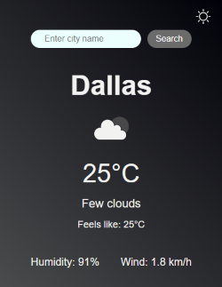

# React Weather App

A simple weather application built with React and Vite that allows users to search for the current weather conditions in a city. It fetches data from the OpenWeatherMap API and supports light and dark themes.

## Features

- Search for weather by city name.
- Displays current temperature, condition, humidity, wind speed and "feels like" temperature.
- Shows a weather icon representing the current conditions.
- Loading state indicator while fetching data.
- Error handling for API issues or city not found.
- Light and Dark theme support with persistence via `localStorage`.

## Screenshot




## Tech Stack

- **React**: JavaScript library for building user interfaces.
- **Vite**: Next-generation front-end tooling for fast development.
- **JavaScript (ES6+)**: Programming language.
- **CSS**: Styling (using CSS Custom Properties for theming).
- **OpenWeatherMap API**: For fetching weather data.

## Prerequisites

Before you begin, ensure you have met the following requirements:

- [Node.js](https://nodejs.org/) (LTS version recommended)
- npm (comes with Node.js) or yarn

## Getting Started

### 1. Clone the Repository

If you're setting this up from a cloned repository:

```bash
git clone https://github.com/LenaM777/weather-app-react.git
cd weather-app-react
```

### 2. Install Dependencies

Navigate to the project directory and install the required npm packages:

```bash
npm install
# or
# yarn install
```

### 3. Set Up Environment Variables

This application requires an API key from [OpenWeatherMap](https://openweathermap.org/appid).

1.  Sign up for a free API key at [OpenWeatherMap](https://openweathermap.org/appid).
2.  Create a file named `.env.local` in the root of your project directory (e.g., alongside `package.json`).
3.  Add your API key to this file:

    ```env
    VITE_OPENWEATHERMAP_API_KEY=YOUR_ACTUAL_API_KEY_HERE
    ```

    Replace `YOUR_ACTUAL_API_KEY_HERE` with the API key you obtained.

    **Important:** The `.env.local` file is included in `.gitignore` by default to prevent your API key from being committed to version control.

### 4. Run the Development Server

Once the dependencies are installed and the environment variable is set, you can start the development server:

```bash
npm run dev
# or
# yarn dev
```

This will usually start the app on `http://localhost:5173`. Open this URL in your web browser to see the application.

## Project Structure

```
my-weather-app/
├── public/
├── src/
│   ├── assets/
│   ├── components/
│   │   ├── SearchBar/
│   │   │   ├── SearchBar.jsx
│   │   │   └── SearchBar.css
│   │   ├── WeatherDisplay/
│   │   │   ├── WeatherDisplay.jsx
│   │   │   └── WeatherDisplay.css
│   ├── services/
│   │   └── weatherService.js
│   ├── App.css
│   ├── App.jsx
│   └── main.jsx
├── .env.local
├── .eslintrc.cjs
├── .gitignore
├── index.html
├── package-lock.json
├── package.json
├── README.md
└── vite.config.js
```

## How It Works

1.  The `App` component manages the main state, including the current `theme`, `weatherData`, `isLoading` status, and `error` messages.
2.  The `SearchBar` component allows users to input a city name and trigger a search.
3.  When a search is initiated, `App.jsx` calls the `fetchWeatherData` function from `weatherService.js`.
4.  `weatherService.js` constructs the API URL (using the API key from `.env.local`) and makes a request to the OpenWeatherMap API.
5.  The `App` component updates its state based on the API response (data, loading, or error).
6.  The `WeatherDisplay` component conditionally renders the fetched weather information or appropriate messages.
7.  Theme switching is handled by changing a `data-theme` attribute on the `<html>` element, and CSS Custom Properties are used to apply different styles for light and dark modes. The theme preference is saved in `localStorage`.
